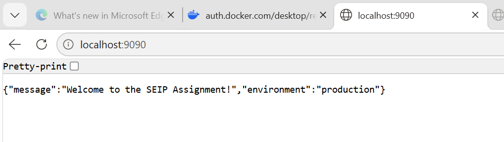
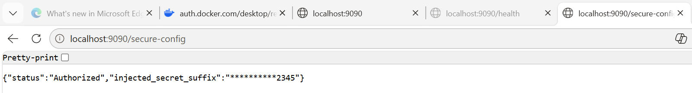

# SEIP Assignment 1 — Submission

## GitHub Repository

[https://github.com/VasilikiZontanou/seip_assignment_1_2026](https://github.com/VasilikiZontanou/seip_assignment_1_2026)

---

## 1. CI/CD Proof

The following screenshots show the successful GitHub Actions pipeline run that built and pushed the Docker image to GHCR.

**Actions Dashboard:**

**Pipeline Steps:**

---

## 2. Cluster State Proof

**`kubectl get all -n default`** — showing 3 healthy running pods, the deployment, the ReplicaSet, and the ClusterIP service:

**`kubectl get configmap,secret`** — showing the ConfigMap and Secret created from the k8s/ manifests:

---

## 3. Application Verification Proof

**`http://localhost:9090/`** — showing the custom ConfigMap greeting and production environment:

**`http://localhost:9090/secure-config`** — showing status "Authorized" and the masked secret suffix:

---

## 4. AI Reflection & Future Outlook

### AI Integration

Claude Sonnet 4.6 was used as an interactive assistant throughout this assignment. Firstly, it was used to provide clarifications and explanation on subjects I lacked previous experience and knowledge with, like the Kubernetes structure and the Base64 encoding. Later in the assignment, it helped with debugging and easier/faster creation of first drafts for files such as the README.

### Utility Analysis

The most useful aspects of AI assistance were:

- **Error diagnosis** — when the GitHub Actions pipeline failed with `repository name must be lowercase` and `denied: installation not allowed to Create organization package`, Claude identified the root cause and provided guidance to fix immediately.
- **Kubernetes manifest structure** — explaining the relationship between Deployments, Services, ConfigMaps, and Secrets in plain language made the structure easier to understand.
- **Base64 encoding on Windows** — when the `base64` command was not available on the system, Claude provided the equivalent PowerShell command `[Convert]::ToBase64String(...)` as an alternative.
- **Markdown Files** — Claude assisted in the formatting of the README and ASSIGNMENT markdown files, making the process much easier.

### Friction Points

- **GitHub Actions expression syntax** — Claude initially suggested `${{ github.repository_owner | lower }}` to lowercase the image tag, which is not valid syntax in GitHub Actions expressions. This resulted in a workflow file validation error and required a corrected approach using a separate shell step with `tr '[:upper:]' '[:lower:]'`.
- **Windows environment differences** — several commands (such as `base64`) are not available natively on Windows Command Prompt, requiring workarounds via PowerShell or Git Bash.

### Future Architectural Outlook

Working through this assignment made it clear that while the current setup works well for a small project, it would quickly become difficult to manage at a larger scale. For example, having to manually run `kubectl port-forward` every time you want to access the application, or manually applying manifests with `kubectl apply`, feels manageable for one service but would become chaotic across dozens of services in a real company.

It therefore makes sense to replace port-forwarding with an Ingress Controller, which would handle routing traffic to the right service automatically, without any manual commands. Similarly, adopting a GitOps approach with a tool like ArgoCD would mean that pushing code to `main` is enough — the cluster would update itself, removing the need to run kubectl commands at all.

On the security side, it would help adding automated **image scanning** to the pipeline so that any known vulnerabilities in the Docker image are caught before the image is pushed to the registry. For visibility into how the application is actually running, tools like **Prometheus** and **Grafana** could provide real-time dashboards showing pod health and resource usage.

Finally, as the number of environments grows (development, staging, production), managing separate YAML files for each would become messy. Packaging the manifests as a **Helm chart** would allow all environments to share the same templates with only their specific values differing.
